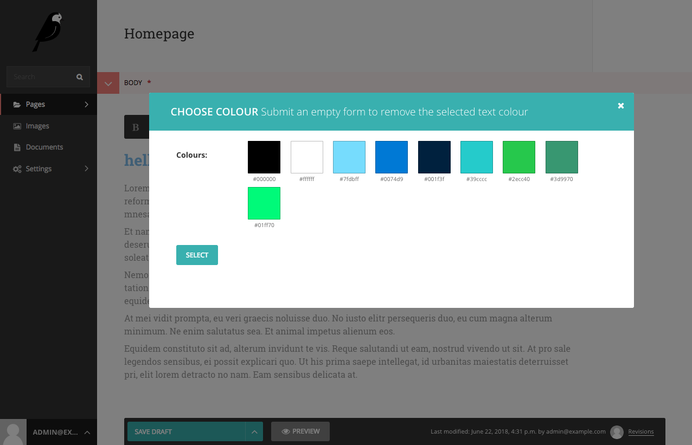

Wagtail ColourPicker
====================

A colour picker for Wagtail's DraftJS editor.

Installation
------------

.. code:: bash

   pip install wagtailcolourpicker

Setup
-----

Add to installed app:

.. code:: python

   INSTALLED_APPS = [
      ...
      'wagtailcolourpicker',
      ...
   ]

Settings
--------

.. code:: python

   # picker icon
   WAGTAILCOLOURPICKER_ICON = ['...']
   # Add your colours
   WAGTAILCOLOURPICKER_COLOURS = {
      'black': '#000000',
      'white': '#ffffff'
   }

Documentation
-------------

TODO

Screenshots
-----------

Picker

.. figure:: screen_2.png
   :width: 728 px

Selected Text

Example site with docker
------------------------

Clone the repo

.. code:: bash

    $ git clone https://github.com/AccentDesign/wagtailcolourpicker.git

Run the docker container

.. code:: bash

    $ cd wagtailcolourpicker
    $ docker-compose up

Create yourself a superuser

.. code:: bash

    $ docker-compose exec app bash
    $ python manage.py createsuperuser

Go to http://127.0.0.1:8000/cms and add a new basic page

Testing
-------

TODO